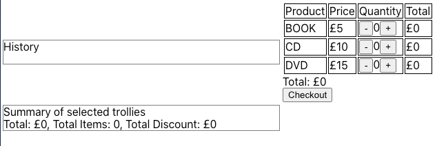
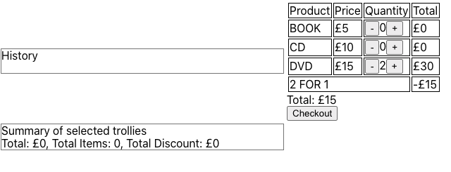
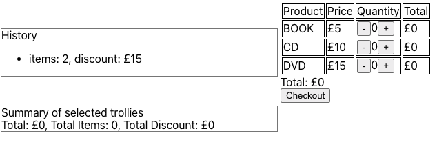
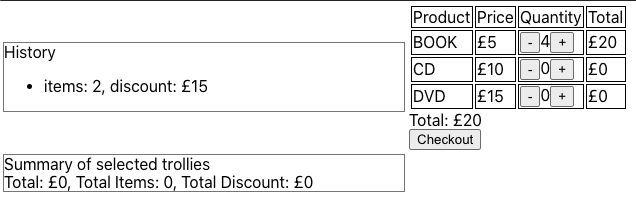
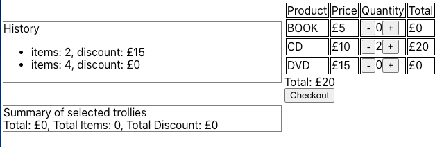
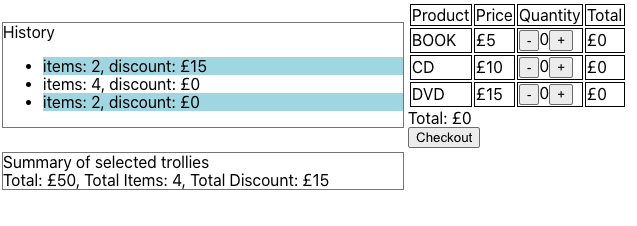

# **Retailer Project**

#### Initial README.md file for giving task:

Please see original readme for this task: `Initial_README.md`

## **Brief Description**

#### Task ONE: 
The initial objective is to develop a Command Line Interface (CLI) application that manages three product types: books, CDs, and DVDs. 
The retailer provides special offers every Thursday, offering a 20% discount on all purchases or a 2-for-1 deal on DVDs. 
Upon completing a transaction, a receipt detailing the purchase is output to the console in a specific format mentioned in `Initial_README.md`.

To test this feature, execute the following command:

`CLIApplication.java`

Please ensure that you have compiled the application before attempting to run it. Use the following Maven command to build the project:

`mvn clean install`

#### Task TWO:

The second task involves integrating Spring and React into the project. The detailed requirements for this integration are outlined in the `Initial_README.md` document.

## **Task ONE:**

## GitHub link for development cycle:

[Retailer_CLI - GitHub](https://github.com/erhnaks/Retailer_CLI)

### Branches:

- main
- development
- feature-class
- feature-retailer-business-logic-implementation
- bug-testcase-in-infinite-loop

## Initial Tests Failures:

In order to begin developing test scenarios, I attempted to run the tests only to have them fail. 
I discovered that one test was stuck in an infinite loop, which was the reason tests were failing to finish. 
In order to match the date == Thursday, I also had to adjust another test that involved adding one day to the current date.

Initial Test:

`LocalDate thursday = LocalDate.now();
while (!thursday.getDayOfWeek().equals(DayOfWeek.THURSDAY)) {
thursday.plusDays(1);
}`

After the infinite loop problem was fixed:

`LocalDate thursday = LocalDate.now();
while (!thursday.getDayOfWeek().equals(DayOfWeek.THURSDAY)) {
thursday = thursday.plusDays(1);
}`

Screenshot of the initial test run:

Another problem with the test testDiscount2For1OnThursdays() is that it was failing because the sum seemed off. 
Would you kindly look at the below? The original test case was manually corrected and commented out. 
Kindly inform me if this was incorrect.

Comparison of the corrected version with the initial test receipt (NB: PLEASE SEE COMMENT):

### Running the tests:

### CLI test-run:

## **Task TWO:**

### React and Spring Implementation:

#### Get call Postman response:
`[
  {
    "type": "BOOK",
    "price": 5
  },
  {
    "type": "CD",
    "price": 10
  },
  {
    "type": "DVD",
    "price": 15
  }
]`

#### Post response in Postman returns 201 Created
`curl -X 'POST' \
  'http://localhost:8080/api/trolley' \
  -H 'accept: */*' \
  -H 'Content-Type: application/json' \
  -d '{
  "items": [
    {
      "type": "BOOK",
      "quantity": 1
    },     {
      "type": "CD",
      "quantity": 2
    }, 
    {
      "type": "DVD",
      "quantity": 3
    }
  ]
}'`

#### Get call to retrieve trollies list with Postman:
`[
  {
    "items": [
      {
        "product": {
          "type": "DVD",
          "price": 15
        },
        "quantity": 3,
        "discount": 0,
        "total": 45
      },
      {
        "product": {
          "type": "BOOK",
          "price": 5
        },
        "quantity": 1,
        "discount": 0,
        "total": 5
      },
      {
        "product": {
          "type": "CD",
          "price": 10
        },
        "quantity": 2,
        "discount": 0,
        "total": 20
      }
    ],
    "totalDiscount": 15
  }
]`

## Retailer initial screen:

### Retailer before checkout:

### Retailer after checkout:

### Retailer checkout 2:

### Retailer checkout 3:

### Retailer report:

##### Implemented new reset button to clear summaries section. Also Retailer_ClI now highlights the selected orders in the History section.

##### Last five orders are now introduced with an unique ID to retrieve from the History and display in Summary, with the new ID implementation App is preventing it from adding to the summary section twice.

***

# Initial Readme.md
##### A copy of initial task readme.md. 

# Generic Retailer

Generic retailer is creating a self service CLI to allow developers to order products.

A developer started implementing but didn't get very far at all, the only thing left are these notes.

Prices:
- Book £5
- CD  £10
- DVD £15

Todo's:

- [ ] Calculate total
- [ ] Print receipt (show items, price and total)
  - [ ] Aggregate items in receipt
  - [ ] items left aligned, prices right aligned
  - [ ] see CliTest fo receipt format
- [ ] Add discounts (2 for 1 on DVDs and 20% off on Thursdays)
  - [ ] Only one discount can apply to an item but customer should get best available discount per item. i.e. 3 DVDs on a Thursday would be £27 (2 for 1 and 20% off the 3rd).

## The 1st Task

Given the above please finish implementing the rest of the system.
Whilst this store has very few items at the moment, we know it's going to grow massively in the next few months.
Please create a solution that is extendable and makes use of common patterns and OO concepts where appropriate.
Please feel free to make use any third-party libraries.

## The 2nd Task
Due to its popularity, they decide to implement a browser user interface to this functionality with some additional capabilities.

Todo's:

- [ ] Implement a UI for use in a browser to add Books, CDs and DVDs to checkout with discount
- [ ] Once a trolley is checked out it is saved to the server (Database.java)
- [ ] The list of previous checkouts is listed with the number of items and discount
- [ ] The user is able to choose checked out trollies to see a summary

Please use react and any other third-party libraries to implement this functionality.
Some screenshots are shown below to explain the functionality further and to suggest a design.

Author: Erhan Aksu